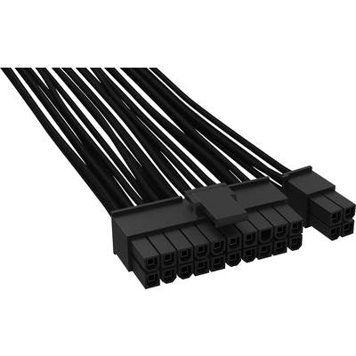
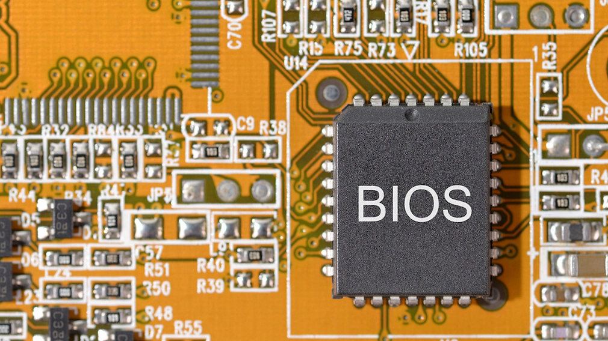
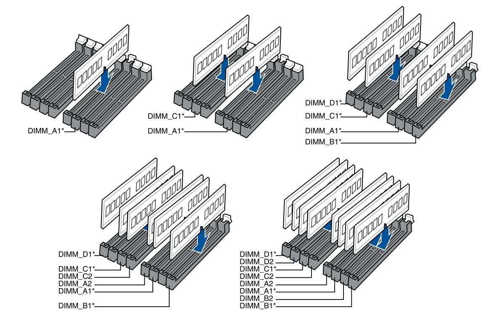
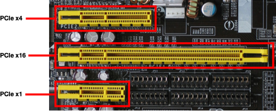
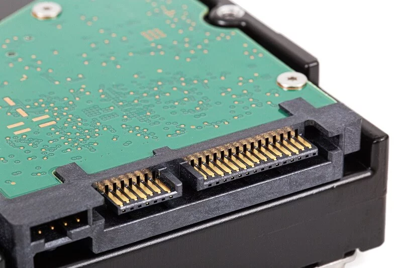
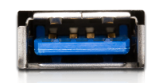
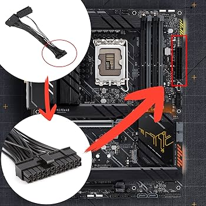
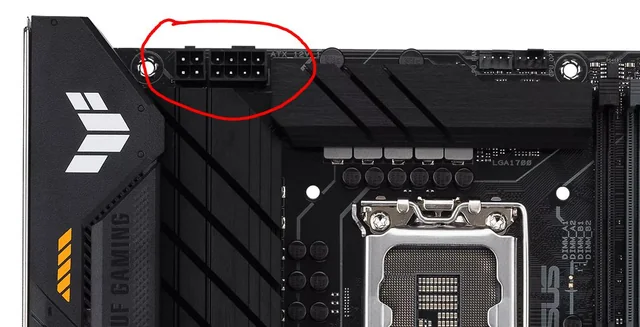

# Theoretische Fragen 1:

**1. Erkläre die Aufgabe des Mainboards!**

Das Mainboard, auch als Hauptplatine oder Motherboard bezeichnet, ist die zentrale Platine eines Computers, die alle wichtigen Komponenten miteinander verbindet.

Es ist verantwortlich für die Kommunikation zwischen der CPU, dem Arbeitsspeicher, den Erweiterungskarten, dem Speicher und anderen Peripheriegeräten. Zu den Hauptaufgaben gehören:

Stromverteilung: Bereitstellung von Strom für andere Komponenten.
Datenübertragung: Ermöglichen der Kommunikation zwischen der CPU, dem RAM und anderen Geräten.
Erweiterungsmöglichkeiten: Bereitstellung von Steckplätzen für Erweiterungskarten und andere Hardware.
Anschlussmöglichkeiten: Bereitstellung von Ports für externe Geräte, wie USB, HDMI, Ethernet usw.
BIOS/UEFI-Firmware: Bereitstellung eines grundlegenden Systems, um den Computer zu starten.

**2. Was ist der Formfaktor des Mainboards? Erstelle eine Tabelle mit verschiedenen Standards, ihren Maßen und typischen Einsatzgebieten!**
Der Formfaktor bestimmt die Größe, Form und die Position der Komponenten auf dem Mainboard. Hier ist eine Tabelle mit verschiedenen Formfaktoren, ihren Maßen und typischen Einsatzgebieten:
|Formfaktor|Maße (mm)|Typische Einsatzgebiete|
|----------|---------|-----------------------|
|ATX|305 x 244|Desktop-PCs, Workstations|
|Micro-ATX|244 x 244|Kompakte Desktop-PCs|
|Mini-ITX|170 x 170	|HTPCs, Embedded Systeme|
|E-ATX|305 x 330|High-End Gaming PCs|
|XL-ATX	|345 x 262	|Enthusiasten und Gaming-PCs|

**3. Nenne die wichtigsten Komponenten auf dem Mainboard! Gib zu jeder Komponente Bilder an!**

[Prozessor (CPU)](Bilder_Infobase/prozessor.png)

[Arbeitsspeicher (RAM)](Bilder_Infobase/ram.png)

Erweiterungssteckplätze (PCIe) 

**4. Nenne die wichtigsten Bussysteme für Mainboards! Erstelle eine kurze Liste wichtigster Erweiterungsbussysteme und in etwa dem Zeitbereich ihrer Verbreitung!**

ISA (Industry Standard Architecture)

*Zeitbereich*: 1980er bis 1990er Jahre

*Beschreibung*: Älterer Standard für Erweiterungskarten, hauptsächlich in frühen PCs.

PCI (Peripheral Component Interconnect)

Zeitbereich: 1990er bis 2000er Jahre

*Beschreibung*: Weit verbreitet für Erweiterungskarten wie Grafikkarten und Netzwerkkarten.

AGP (Accelerated Graphics Port)

Zeitbereich: 1997 bis 2008

*Beschreibung*: Speziell für Grafikkarten entwickelt, um höhere Bandbreiten zu ermöglichen.

PCI Express (PCIe)

Zeitbereich: 2004 bis heute

*Beschreibung*: Der derzeitige Standard für Erweiterungskarten mit deutlich höherer Geschwindigkeit als PCI und AGP.

VESA Local Bus

*Zeitbereich:* 1992 bis 1997

*Beschreibung:* Ein früher Standard zur Verbindung von Grafikkarten mit der CPU.

**5. Nenne die wichtigsten externen Anschlüsse des Mainboards und ihre Aufgabe! Gib zu jedem Anschluss Bilder an!**

|Anschluss|Aufgabe|Beschreibung| Bilder |
|---------|-------|------------|--------|
|CPU-Sockel (Socket)|Verbindung der CPU mit dem Mainboard|Flache, rechteckige Fläche mit Pins oder Löchern|  |
|RAM-Sockel (DIMM-Slots)|Aufnahme der RAM-Module|Lange, schmale Slots, parallel angeordnet|  |
|PCIe-Steckplätze|Verbindung von Erweiterungskarten|Längliche Slots (x1, x4, x8, x16)|  |
|SATA-Anschlüsse|Anschluss von SSDs und HDDs|Kleine, flache Anschlüsse, oft in einer Reihe|  |
|M.2-Steckplätze|Anschluss von NVMe-SSDs oder WLAN-Karten|Rechteckige, flache Slots, oft senkrecht zum Mainboard|  |
|USB-Header|Anschluss von USB-Anschlüssen im Gehäuse|Mehrpolige Stecker, oft in einer Reihe|  |
|24-Pin ATX-Stromanschluss|Stromversorgung des Mainboards|Großer, rechteckiger Stecker mit vielen Pins|  |
|4/8-Pin CPU-Stromanschluss|Zusätzliche Stromversorgung für die CPU|Kleinere Stecker, oft quadratisch oder rechteckig|  |

**6. Was ist eine Riser-Karte?**
Eine Riser-Karte ist eine Erweiterungskarte, die in einem PC verwendet wird, um zusätzliche Erweiterungssteckplätze zu schaffen. Sie ermöglicht es, zusätzliche Karten (wie Grafikkarten oder andere Erweiterungen) in einem anderen Winkel oder an einem anderen Ort im Gehäuse zu platzieren, was besonders in kompakten oder spezialisierten Systemen nützlich ist, in denen der Platz begrenzt ist. Riser-Karten sind oft in Servern oder speziellen Gaming-PCs zu finden.

**7.Was ist eine Riser-Karte?**

Eine Riser-Karte ist eine Erweiterungskarte, die in einem PC verwendet wird, um zusätzliche Erweiterungssteckplätze zu schaffen. Sie ermöglicht es, zusätzliche Karten (wie Grafikkarten oder andere Erweiterungen) in einem anderen Winkel oder an einem anderen Ort im Gehäuse zu platzieren, was besonders in kompakten oder spezialisierten Systemen nützlich ist, in denen der Platz begrenzt ist. Riser-Karten sind oft in Servern oder speziellen Gaming-PCs zu finden.